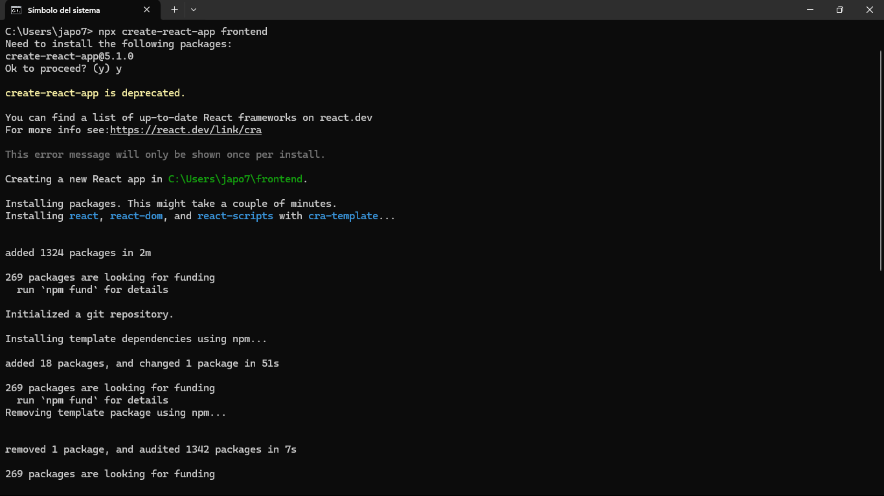
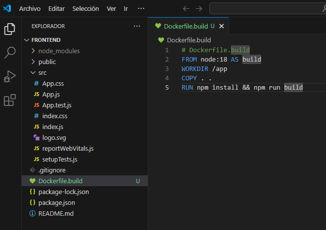
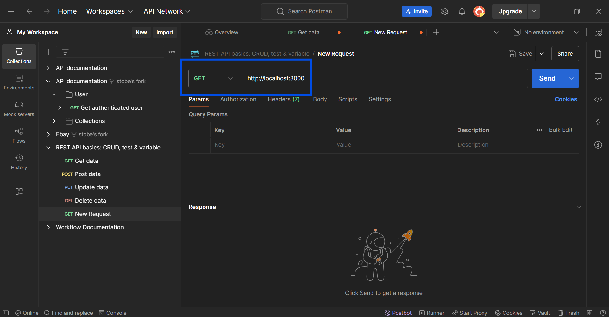

# Práctica Servidor Web

## 1. Título  
**Despliegue de una aplicación frontend con Nginx en producción, conectada al backend y base de datos usando Docker y Docker Compose**

## 2. Tiempo de duración  
**90 minutasos**

## 3. Fundamentos  
El despliegue de aplicaciones web modernas se beneficia ampliamente del uso de contenedores. Docker permite encapsular el frontend, backend y base de datos en entornos independientes, estandarizados y portables. Al separar cada componente en su propio contenedor, logramos una arquitectura desacoplada que facilita el mantenimiento, escalado y despliegue.

El frontend se compila utilizando Node.js y luego se sirve en modo producción mediante Nginx, un servidor web eficiente que puede manejar una gran cantidad de solicitudes concurrentes. Nginx es ideal para servir archivos estáticos como HTML, CSS y JS, y también puede actuar como proxy inverso hacia un backend.

El backend, implementado en cualquier lenguaje o framework (Node.js, Spring Boot, etc.), se conecta a la base de datos para procesar la lógica de negocio. Por su parte, la base de datos (como PostgreSQL o MySQL) corre en su propio contenedor con persistencia de datos opcional a través de volúmenes.

La herramienta `docker-compose` permite definir y coordinar todos estos servicios en un solo archivo (`docker-compose.yml`), facilitando el orquestamiento de contenedores.


*Figura 1-1. Diagrama de contenedores en arquitectura de despliegue.*

## 4. Conocimientos previos  
Para realizar esta práctica, lo que se necesita tener claro son los siguientes temas:

- Comandos básicos de Linux.
- Estructura de archivos HTML/JS/CSS.
- Uso de terminal y línea de comandos.
- Conceptos de contenedores Docker.
- Manejo de navegadores y herramientas de desarrollo.
- Configuración básica de Nginx.

## 5. Objetivos a alcanzar  
- Implementar contenedores para frontend, backend y base de datos.
- Servir el frontend compilado con Nginx.
- Manipular archivos de configuración Docker y Nginx.
- Integrar los servicios usando `docker-compose`.

## 6. Equipo necesario  
- Computador con sistema operativo Windows, Linux o MacOS.
- Docker Desktop o Docker Engine instalado.
- Editor de texto (VSCode recomendado).
- Acceso a DockerHub (opcional).
- Conexión a internet.

## 7. Material de apoyo  
- [Documentación oficial de Docker](https://docs.docker.com/)
- [Material del eva ](#)
- [Cheat Sheet de comandos Linux](https://cheatography.com/davechild/cheat-sheets/linux-command-line/)

## 8. Procedimiento

### Paso 1: Crear proyecto del frontend  
Estructura básica en React, Vue o Angular. Por ejemplo el mio, con React:

```bash
npx create-react-app frontend
cd frontend
````




### Paso 2: Crear Dockerfile para el build del frontend

Dentro del directorio `frontend/` crea un archivo `Dockerfile.build`:

```dockerfile
# Dockerfile.build
FROM node:18 AS build
WORKDIR /app
COPY . .
RUN npm install && npm run build
```


### Paso 3: Crear Dockerfile para el servidor Nginx

Archivo `Dockerfile` (en la raíz del proyecto):

```dockerfile
# Dockerfile
FROM nginx:alpine
COPY --from=build /app/build /usr/share/nginx/html
COPY nginx.conf /etc/nginx/nginx.conf
```

### Paso 4: Crear archivo de configuración `nginx.conf`

```nginx
# nginx.conf
events { }

http {
  include       mime.types;
  default_type  application/octet-stream;
  server {
    listen 80;
    location / {
      root /usr/share/nginx/html;
      index index.html;
      try_files $uri /index.html;
    }
  }
}
```

### Paso 5: Crear backend y base de datos (Yo ya lo tengo)

```dockerfile
# backend/Dockerfile
FROM node:18
WORKDIR /app
COPY . .
RUN npm install
CMD ["npm", "start"]
```

### Paso 6: Crear archivo `docker-compose.yml` en la raíz del proyecto

```yaml
version: '3.8'
services:
  frontend:
    build:
      context: ./frontend
      dockerfile: Dockerfile
    ports:
      - "80:80"
    depends_on:
      - backend

  backend:
    build: ./backend
    ports:
      - "4000:4000"
    environment:
      - DB_HOST=db
      - DB_PORT=5432
    depends_on:
      - db

  db:
    image: postgres:15
    restart: always
    environment:
      POSTGRES_USER: user
      POSTGRES_PASSWORD: password
      POSTGRES_DB: mydb
    volumes:
      - pgdata:/var/lib/postgresql/data

volumes:
  pgdata:
```

## En mi caso ya tenia un proyecto realizado para levantar sin necesidad de volver a hacerlo que era de anterior practica.

### Paso 7: Ejecutar el entorno completo

```bash
docker-compose up --build
```

### Paso 8: Verificar que todo funcione

Abre `http://localhost` en tu navegador para visualizar el frontend.

## 9. Resultados esperados y obtenidos

* El frontend se muestra correctamente servido desde Nginx.
* El backend responde desde el puerto 4000.
* La base de datos está conectada y persistente en un volumen Docker.




## 10. Bibliografía

* Docker Inc. (n.d.). *Docker documentation*. Retrieved from [https://docs.docker.com/](https://docs.docker.com/)
* Nginx Inc. (n.d.). *NGINX Documentation*. Retrieved from [https://nginx.org/en/docs/](https://nginx.org/en/docs/)
* Ryan, F. (2020). *Fullstack React with Docker*. O’Reilly Media.

## Audio

https://drive.google.com/file/d/1MuOXa5DzBDJyru3b8sCcFmrDRSbweQkR/view?usp=sharing