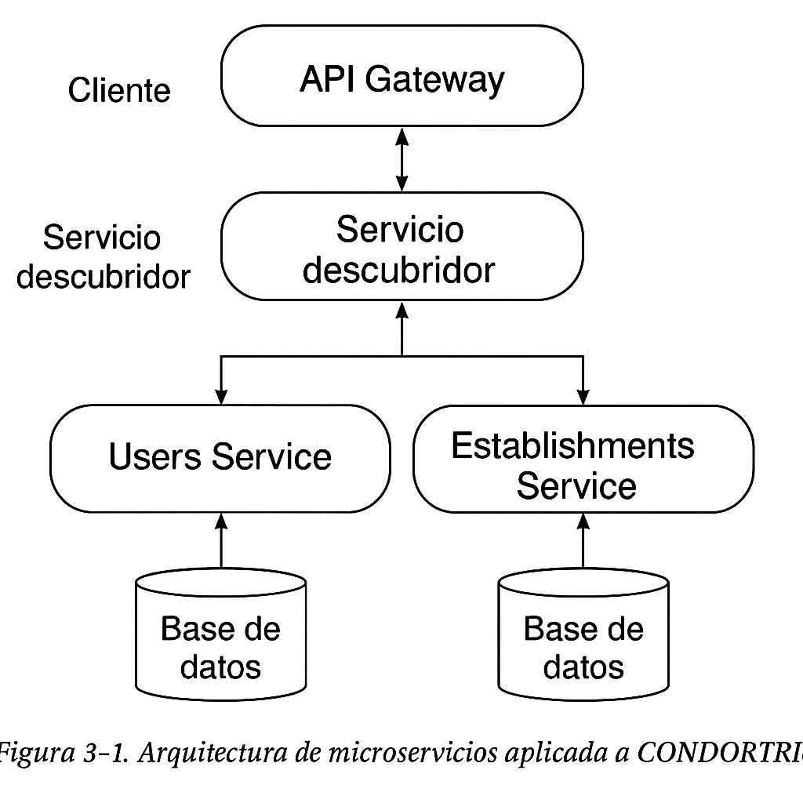
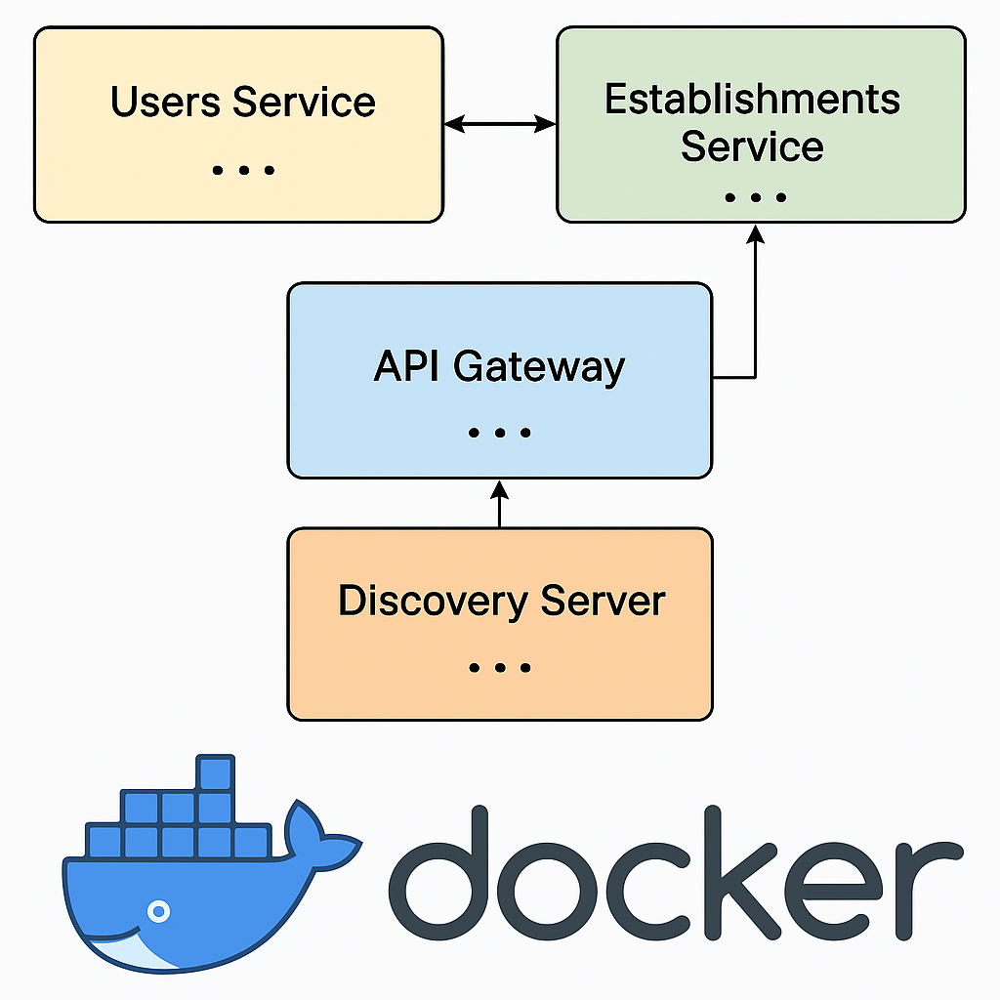
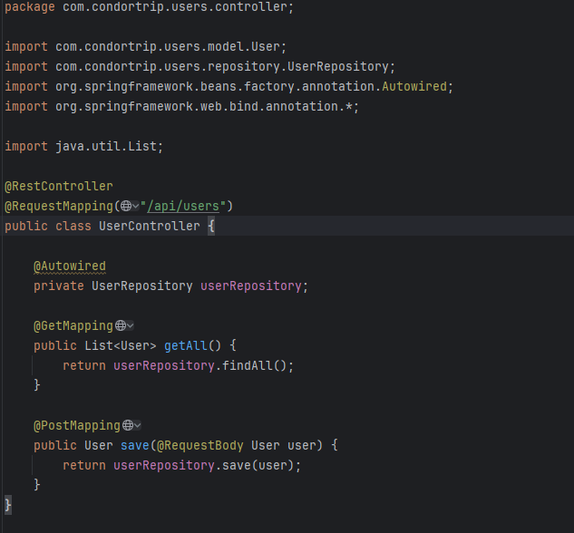
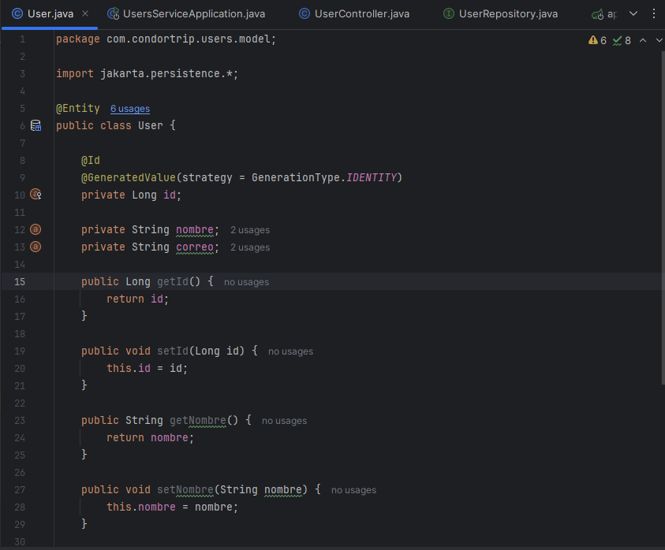
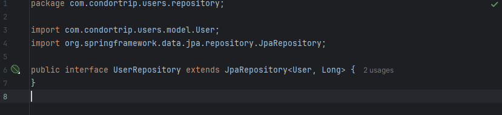

# Práctica Microservicios - Arquitectura aplicada a CONDORTRIP

## 1. Título
Implementación de Microservicios con Eureka y API Gateway en la app turística CONDORTRIP

## 2. Tiempo de duración
180 minutos

## 3. Fundamentos

La arquitectura de microservicios representa una evolución frente al modelo monolítico tradicional. En lugar de que una sola aplicación gestione todas las funcionalidades, esta arquitectura distribuye la lógica en servicios independientes, especializados y autónomos. Cada microservicio se centra en una responsabilidad específica, tiene su propia base de datos y puede desplegarse de manera separada, lo cual permite una mayor escalabilidad, mantenibilidad y resiliencia.

En esta práctica se aplica esta arquitectura al proyecto **CONDORTRIP**, una app móvil turística para el barrio San Blas (Cuenca), separando dos funcionalidades críticas en microservicios:

- **Gestión de Usuarios**: Manejo de registro, login, perfiles y autenticación.
- **Gestión de Establecimientos Afiliados**: Control de los negocios gastronómicos y turísticos registrados en la app (nombre, categoría, horarios, promociones, etc.).

Se utilizarán los siguientes componentes clave:
- **Eureka Server** como servicio de descubrimiento.
- **Spring Cloud Gateway** como punto de entrada a los microservicios.
- **Docker y Docker Compose** para contenedores y orquestación.
- **APIs RESTful** para exponer las operaciones CRUD.

**Figura 3-1. Arquitectura de microservicios aplicada a CONDORTRIP**



## 4. Conocimientos previos

Para realizar esta práctica se recomienda dominar:

- Principios de microservicios
- Manejo de Spring Boot y Java
- Comandos básicos de Linux
- Configuración de Eureka y Gateway
- Uso de Postman para pruebas
- Docker y Docker Compose
- Modelado de bases de datos

## 5. Objetivos a alcanzar

- Separar funcionalidades clave de CONDORTRIP en microservicios independientes.
- Implementar Eureka como servicio de descubrimiento.
- Configurar un API Gateway para enrutar solicitudes.
- Crear operaciones CRUD para usuarios y establecimientos.
- Desplegar los servicios usando Docker.

## 6. Equipo necesario

- Computador Windows/Linux/Mac
- Java JDK 17 o superior
- Spring Boot
- Docker Desktop o Docker Engine
- Docker Compose
- PostgreSQL
- Postman
- Editor de código (IntelliJ, VS Code, etc.)

## 7. Material de apoyo

- [Spring Boot Documentation](https://spring.io/projects/spring-boot)
- [Spring Cloud Gateway Docs](https://spring.io/projects/spring-cloud-gateway)
- [Spring Cloud Netflix Eureka](https://cloud.spring.io/spring-cloud-netflix/)
- [Docker Docs](https://docs.docker.com/)
- Cheat sheet de comandos 

## 8. Procedimiento

### Paso 1: Crear los microservicios

- `users-service`: CRUD de usuarios
- `establishments-service`: CRUD de establecimientos turísticos

Cada servicio es un proyecto Spring Boot con sus dependencias (Web, JPA, PostgreSQL, Eureka Client).

### Paso 2: Crear Eureka Server

- Nuevo proyecto Spring Boot: `discovery-server`
- Incluir dependencia: `spring-cloud-starter-netflix-eureka-server`
- Activar con `@EnableEurekaServer`

```java
@SpringBootApplication
@EnableEurekaServer
public class DiscoveryServerApplication { ... }
````

### Paso 3: Crear el API Gateway

* Proyecto `api-gateway` con `spring-cloud-starter-gateway` y `eureka-client`
* Configurar rutas en `application.yml`:

```yaml
spring:
  cloud:
    gateway:
      routes:
        - id: users
          uri: lb://USERS-SERVICE
          predicates:
            - Path=/api/users/**
        - id: establishments
          uri: lb://ESTABLISHMENTS-SERVICE
          predicates:
            - Path=/api/establishments/**
```

### Paso 4: Configurar base de datos separada

Cada microservicio tiene su propia base de datos PostgreSQL definida en `application.yml`.

### Paso 5: Implementar operaciones CRUD

Ejemplo en `users-service`:

* `User.java`: entidad
* `UserRepository.java`: repositorio JPA
* `UserController.java`: API REST

Lo mismo se replica en `establishments-service` para locales turísticos.

### Paso 6: Dockerización

Agregar `Dockerfile` en cada microservicio.

Ejemplo:

```dockerfile
FROM openjdk:17
COPY target/*.jar app.jar
ENTRYPOINT ["java", "-jar", "/app.jar"]
```

### Paso 7: Crear `docker-compose.yml`

```yaml
version: '3.8'
services:

  postgres-users:
    image: postgres
    environment:
      POSTGRES_DB: usersdb
      POSTGRES_USER: user
      POSTGRES_PASSWORD: pass
    ports:
      - "5433:5432"

  postgres-establishments:
    image: postgres
    environment:
      POSTGRES_DB: estdb
      POSTGRES_USER: user
      POSTGRES_PASSWORD: pass
    ports:
      - "5434:5432"

  discovery-server:
    build: ./discovery-server
    ports:
      - "8761:8761"

  api-gateway:
    build: ./api-gateway
    ports:
      - "8080:8080"
    depends_on:
      - discovery-server

  users-service:
    build: ./users-service
    depends_on:
      - discovery-server
      - postgres-users

  establishments-service:
    build: ./establishments-service
    depends_on:
      - discovery-server
      - postgres-establishments
```

**Figura 8-1. Diagrama de microservicios desplegados con Docker**



## 9. Resultados esperados

* Los microservicios se registran correctamente en Eureka ([http://localhost:8761](http://localhost:8761)).
* Se puede acceder a las rutas:

```
GET http://localhost:8080/api/users
POST http://localhost:8080/api/establishments
```

* Cada microservicio opera con su propia base de datos.
* El API Gateway enruta correctamente sin exponer las direcciones internas.

**Captura de Eureka funcionando**


## Anexos






## 10. Bibliografía

* Hernández Sampieri, R., Fernández Collado, C., & Baptista Lucio, P. (2014). *Metodología de la investigación* (6.ª ed.). McGraw-Hill Education.
* Gretzel, U., Sigala, M., Xiang, Z., & Koo, C. (2015). Smart tourism: foundations and developments. *Electronic Markets*.
* Spring Cloud documentation. (s.f.). [https://spring.io/projects/spring-cloud](https://spring.io/projects/spring-cloud)
* Docker Inc. (2024). Docker Documentation. [https://docs.docker.com](https://docs.docker.com)

## Video
https://drive.google.com/file/d/1CfMdEvUzN6NsDFeHs9uB8hwrNfzvvv0P/view?usp=sharing