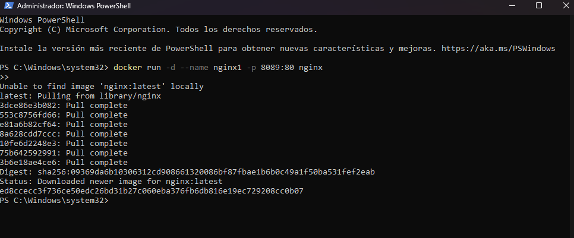
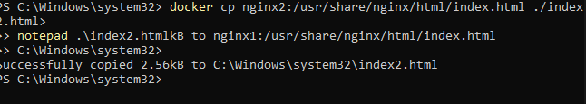

# Práctica No. 1: Despliegue de servidores web con Nginx en Docker

## 1. Título
Creación y personalización de dos servidores web con Nginx utilizando Docker

## 2. Tiempo de duración
120 minutos

## 3. Fundamentos

Docker es una plataforma que permite empaquetar aplicaciones y sus dependencias dentro de contenedores. Un contenedor es una instancia ligera y portátil que se ejecuta de forma aislada en el sistema. Nginx, por otro lado, es un servidor web y proxy inverso muy usado por su alto rendimiento y bajo consumo de recursos.

En esta práctica, se utilizará Docker para desplegar dos instancias del servidor web Nginx, cada una sirviendo un contenido HTML personalizado. Esta técnica es ampliamente usada en entornos DevOps y microservicios, donde cada servicio corre de forma aislada en su propio contenedor.

**Figura 1-1. Arquitectura del entorno con dos contenedores Nginx:**


## 4. Conocimientos previos

Para realizar esta práctica es importante dominar:

- Comandos básicos de Linux (`cd`, `ls`, `nano`, `cp`, etc.)
- Manejo básico de Docker
- Edición de archivos en terminal
- Conceptos básicos de HTML
- Uso de navegador para verificar puertos locales

## 5. Objetivos a alcanzar

- Implementar contenedores con Nginx utilizando Docker
- Manipular archivos HTML dentro de un contenedor
- Personalizar contenido web desde el sistema anfitrión
- Verificar funcionamiento web en diferentes puertos

## 6. Equipo necesario

- Computadora con Windows/Linux/Mac
- Conexión a internet
- Docker instalado (versión recomendada: 24.0+)
- Terminal (Linux/bash o PowerShell)
- Cuenta en [Docker Play](https://labs.play-with-docker.com) (opcional)

## 7. Material de apoyo

- [Documentación oficial de Docker](https://docs.docker.com/)
- Guía de la asignatura
- Linux Command Cheat Sheet
- [Documentación de Nginx](https://nginx.org/en/docs/)

## 8. Procedimiento

### Paso 1: Crear el primer contenedor con Nginx
```bash
docker run -d --name nginx1 -p 8089:80 nginx
```



### Paso 2: Crear el segundo contenedor
```bash
docker run -d --name nginx2 -p 8090:80 nginx
```


### Paso 3: Copiar el archivo `index.html` desde nginx1
```bash
docker cp nginx1:/usr/share/nginx/html/index.html ./index1.html
```

### Paso 4: Editar el archivo `index1.html` con información institucional

```bash
nano index1.html
```

### Paso 5: Volver a copiar el archivo editado al contenedor nginx1
```bash
docker cp index1.html nginx1:/usr/share/nginx/html/index.html
```


### Paso 6: Repetir el proceso para nginx2

```bash
docker cp nginx2:/usr/share/nginx/html/index.html ./index2.html
nano index2.html  # Editar con información personal
docker cp index2.html nginx2:/usr/share/nginx/html/index.html
```

### Paso 7: Verificar los contenedores en el navegador

- Abrir `http://localhost:8089` → Debe mostrar la información institucional.
- Abrir `http://localhost:8090` → Debe mostrar la información personal.


## 9. Resultados esperados

- Ambos servidores deben estar activos y accesibles desde el navegador en los puertos correspondientes.
- La personalización del contenido HTML debe reflejarse correctamente en cada uno.

## 10. Bibliografía

Docker Inc. (s.f.). *Docker Documentation*. https://docs.docker.com  
NGINX Inc. (s.f.). *Official NGINX Documentation*. https://nginx.org/en/docs/  
García, M. (2021). *Introducción a Docker*. Editorial Tecnológica.  


## Audio :
https://drive.google.com/file/d/15dBEoSPPF_JkE-BXqjG3QoyTKTgvnjCy/view?usp=sharing