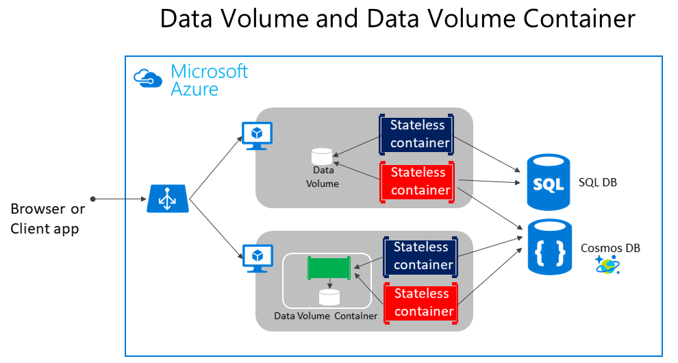
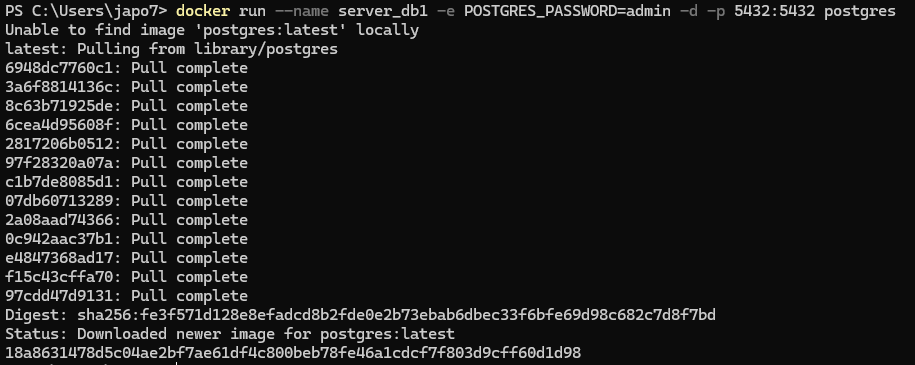
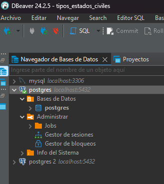
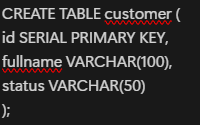
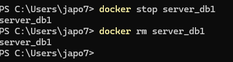
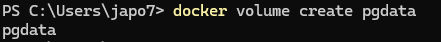
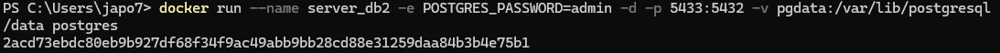
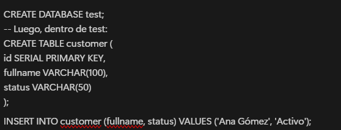
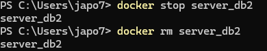
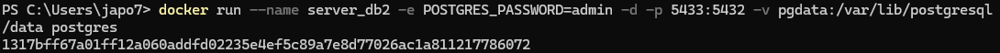

# Práctica No. 3 - Persistencia de Datos con Volúmenes en PostgreSQL

## 1. Título
Persistencia de bases de datos en contenedores Docker mediante volúmenes en PostgreSQL

## 2. Tiempo de duración
**Duración total:** 90 minutos

## 3. Fundamentos

Docker es una plataforma que permite crear, desplegar y ejecutar aplicaciones dentro de contenedores. Un contenedor es un entorno aislado que contiene todo lo necesario para ejecutar una aplicación, incluyendo librerías, dependencias y configuraciones.

Uno de los retos al usar contenedores para bases de datos como PostgreSQL es la **persistencia de datos**. Por defecto, si un contenedor es eliminado, también se eliminan los datos almacenados dentro de él. Para evitar esta pérdida de información, Docker permite asociar **volúmenes** al contenedor, lo que habilita el almacenamiento persistente fuera del ciclo de vida del contenedor.

Los volúmenes son gestionados por Docker y pueden ser reutilizados por varios contenedores, lo que permite mantener los datos incluso si el contenedor se elimina o actualiza.

### ¿Cómo funciona la persistencia?

- Sin volúmenes: los datos se almacenan en el sistema de archivos interno del contenedor.
- Con volúmenes: los datos se almacenan en el sistema de archivos del host (fuera del contenedor), permitiendo que sobrevivan al ciclo de vida del contenedor.

#### Figura 3-1. Comparación entre contenedor sin y con volumen


## 4. Conocimientos previos

Para desarrollar esta práctica se deben tener conocimientos previos en:

- Comandos básicos de Linux
- Manejo de Docker CLI
- Uso de herramientas de administración de bases de datos (ej. DataGrip, DBeaver, TablePlus)
- Fundamentos de PostgreSQL

## 5. Objetivos a alcanzar

- Ejecutar contenedores PostgreSQL con y sin volúmenes.
- Verificar la diferencia en persistencia de datos entre contenedores efímeros y aquellos que usan volúmenes.
- Comprender la importancia del almacenamiento externo en aplicaciones que requieren persistencia.

## 6. Equipo necesario

- Computadora con sistema operativo Windows / Linux / Mac
- Docker Desktop o acceso a [Docker Playground](https://labs.play-with-docker.com/)
- Docker v20.x o superior
- Cliente de base de datos: TablePlus, DBeaver, DataGrip o similar
- Conexión a internet

## 7. Material de apoyo

- [Documentación oficial de Docker](https://docs.docker.com)
- Guía de asignatura
- Cheat Sheet de comandos Docker
- Documentación oficial de PostgreSQL

## 8. Procedimiento

### Parte 1: Contenedor sin volumen

**Paso 1:** Crear el contenedor PostgreSQL sin volumen:

```bash
docker run --name server_db1 -e POSTGRES_PASSWORD=admin -d -p 5432:5432 postgres
```


**Paso 2:** Conectarse al contenedor desde un cliente (usar `localhost` y puerto `5432`).



**Paso 3:** Crear una base de datos llamada `test`.


**Paso 4:** Crear la tabla `customer`:

```sql
CREATE TABLE customer (
  id SERIAL PRIMARY KEY,
  fullname VARCHAR(100),
  status VARCHAR(50)
);
```



**Paso 5:** Insertar un registro:

```sql
INSERT INTO customer (fullname, status) VALUES ('Juan Pérez', 'Activo');
```


**Paso 6:** Eliminar el contenedor:

```bash
docker stop server_db1
docker rm server_db1
```



**Paso 7:** Volver a crear el contenedor con el mismo nombre:

```bash
docker run --name server_db1 -e POSTGRES_PASSWORD=admin -d -p 5432:5432 postgres
```

**Paso 8:** Verificar que la base de datos `test` y la tabla `customer` ya no existen.


### Parte 2: Contenedor con volumen

**Paso 1:** Crear un volumen en Docker:

```bash
docker volume create pgdata
```



**Paso 2:** Crear un contenedor PostgreSQL usando el volumen:

```bash
docker run --name server_db2 -e POSTGRES_PASSWORD=admin -d -p 5433:5432 -v pgdata:/var/lib/postgresql/data postgres
```



**Paso 3:** Conectarse al contenedor desde el cliente (usar puerto `5433`).

**Paso 4:** Crear nuevamente la base de datos `test`, la tabla `customer` e insertar datos como en la Parte 1.



**Paso 5:** Eliminar el contenedor:

```bash
docker stop server_db2
docker rm server_db2
```



**Paso 6:** Crear nuevamente el contenedor **usando el mismo volumen**:

```bash
docker run --name server_db2 -e POSTGRES_PASSWORD=admin -d -p 5433:5432 -v pgdata:/var/lib/postgresql/data postgres
```



**Paso 7:** Verificar que la base de datos `test` y la tabla `customer` siguen existiendo.


## 9. Resultados esperados

- En la primera parte, al eliminar el contenedor `server_db1`, los datos también se eliminaron.
- En la segunda parte, gracias al volumen `pgdata`, los datos se mantuvieron aunque el contenedor fue eliminado y recreado.

Estos resultados muestran claramente la importancia de usar volúmenes para asegurar la persistencia de los datos.

## 10. Bibliografía

Docker Inc. (2024). *Docker Documentation*. https://docs.docker.com  
PostgreSQL Global Development Group. (2024). *PostgreSQL Documentation*. https://www.postgresql.org/docs  
Pressman, R. S. (2021). *Ingeniería del software: Un enfoque práctico* (7a ed.). McGraw-Hill.

## 11. Audio
https://drive.google.com/file/d/10zEb5RLE7aNUHgflXgnVfr5Bdbk3p3IV/view?usp=sharing