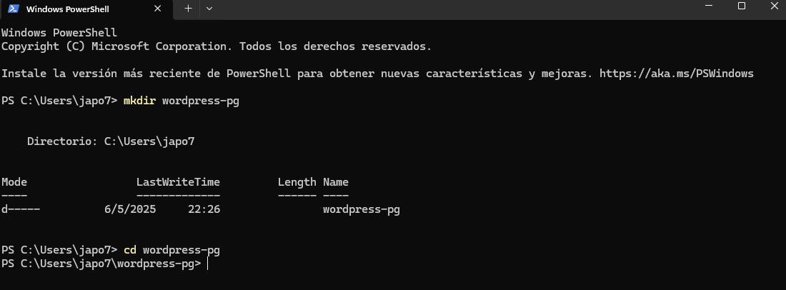

# Práctica servidor web

## 1. Título  
**Implementación de WordPress con PostgreSQL y pgAdmin usando Docker Compose**

## 2. Tiempo de duración  
90 minutos

## 3. Fundamentos

En esta práctica se implementa una solución basada en contenedores que permite levantar un sistema de gestión de contenido (CMS) como **WordPress** conectado a una base de datos **PostgreSQL**, además de contar con la herramienta de administración **pgAdmin** para manejar gráficamente dicha base de datos.

**Docker Compose** es una herramienta de orquestación que permite definir y manejar múltiples contenedores mediante un único archivo `docker-compose.yml`. Esto permite definir servicios, redes y volúmenes de forma sencilla y organizada.

**WordPress**, aunque típicamente usa MySQL/MariaDB, puede funcionar también con PostgreSQL a través de plugins o capas de compatibilidad. Sin embargo, esta práctica se enfoca más en la estructura de red, la persistencia de datos y la visualización mediante pgAdmin, que en la funcionalidad completa del CMS.

**PostgreSQL** es un sistema de base de datos relacional muy robusto, usado ampliamente en ambientes de producción. **pgAdmin** es una herramienta de administración web para PostgreSQL que permite consultar, crear y editar bases de datos gráficamente.

La conexión entre los tres servicios (WordPress, PostgreSQL y pgAdmin) se logra definiendo una **red** personalizada y usando un **volumen** para persistir los datos de PostgreSQL.


## 4. Conocimientos previos

Para realizar esta práctica el estudiante necesita tener claro los siguientes temas:

- Comandos básicos de Linux (cp, mkdir, nano, docker, etc.)
- Uso de navegador web
- Manejo básico de Visual Studio Code
- Conceptos básicos de bases de datos relacionales
- Conocimiento de servicios y puertos de red

## 5. Objetivos a alcanzar

- Implementar contenedores para WordPress, PostgreSQL y pgAdmin usando Docker Compose.
- Configurar una red personalizada y volúmenes persistentes.
- Visualizar la base de datos mediante pgAdmin.
- Comprender el flujo de conexión entre servicios dentro de Docker.

## 6. Equipo necesario

- Computadora con sistema operativo Windows, Linux o macOS.
- Docker v24.x instalado.
- Docker Compose v2.x.
- Acceso a internet.
- Editor de texto (en mi caso: Visual Studio Code).

## 7. Material de apoyo

- [Documentación oficial de Docker Compose](https://docs.docker.com/compose/)
- Guía de asignatura
- Docker cheatsheet
- PostgreSQL Documentation: https://www.postgresql.org/docs/
- pgAdmin Docs: https://www.pgadmin.org/docs/

## 8. Procedimiento

**Paso 1: Crear el directorio de trabajo**

```bash
mkdir wordpress-pg && cd wordpress-pg
````



**Paso 2: Crear el archivo `docker-compose.yml`**

```yaml
version: '3.8'

services:
  db:
    image: postgres:13
    container_name: postgres-db
    environment:
      POSTGRES_USER: wp_user
      POSTGRES_PASSWORD: wp_pass
      POSTGRES_DB: wp_db
    volumes:
      - pgdata:/var/lib/postgresql/data
    networks:
      - wpnet

  pgadmin:
    image: dpage/pgadmin4
    container_name: pgadmin
    environment:
      PGADMIN_DEFAULT_EMAIL: admin@admin.com
      PGADMIN_DEFAULT_PASSWORD: admin
    ports:
      - "5050:80"
    depends_on:
      - db
    networks:
      - wpnet

  wordpress:
    image: wordpress:latest
    container_name: wordpress
    environment:
      WORDPRESS_DB_HOST: db:5432
      WORDPRESS_DB_USER: wp_user
      WORDPRESS_DB_PASSWORD: wp_pass
      WORDPRESS_DB_NAME: wp_db
    ports:
      - "8080:80"
    depends_on:
      - db
    networks:
      - wpnet

volumes:
  pgdata:

networks:
  wpnet:
```


**Paso 3: Levantar los contenedores**

```bash
docker-compose up -d
```


**Paso 4: Verificar los servicios en el navegador**

* WordPress: [http://localhost:8080](http://localhost:8080)
* pgAdmin: [http://localhost:5050](http://localhost:5050)


*Figura  Interfaz de instalación de WordPress*


*Figura  pgAdmin conectando a PostgreSQL*


## 9. Resultados esperados

* Acceso exitoso a la interfaz de instalación de WordPress en el navegador.
* Conexión desde pgAdmin a la base de datos `wp_db` usando las credenciales definidas.
* Persistencia de datos incluso después de reiniciar los contenedores gracias al volumen definido.
* Visualización clara de la arquitectura y flujo de conexión entre servicios.

## 10. Bibliografía

Docker, Inc. (2024). *Docker Compose Overview*. [https://docs.docker.com/compose/](https://docs.docker.com/compose/)

PostgreSQL Global Development Group. (2024). *PostgreSQL Documentation*. [https://www.postgresql.org/docs/](https://www.postgresql.org/docs/)

Pressman, R. S. (2020). *Ingeniería del software: Un enfoque práctico* (7.ª ed.). McGraw-Hill.

pgAdmin Development Team. (2024). *pgAdmin 4 Documentation*. [https://www.pgadmin.org/docs/](https://www.pgadmin.org/docs/)


## Audio
https://drive.google.com/file/d/1mvl-Okzzq_F9EIY_b63T9AsNMKHiu3bI/view?usp=sharing
