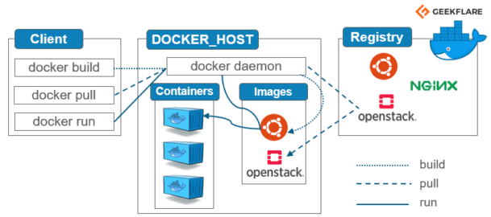
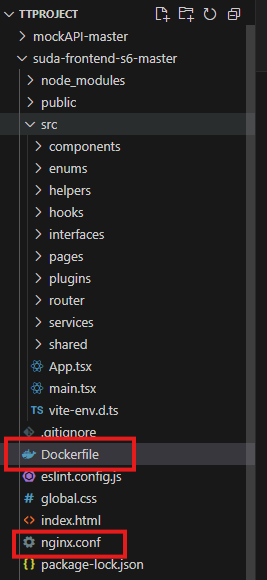
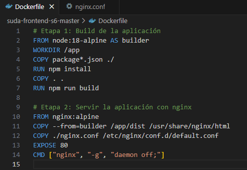
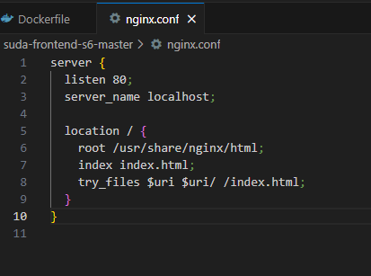
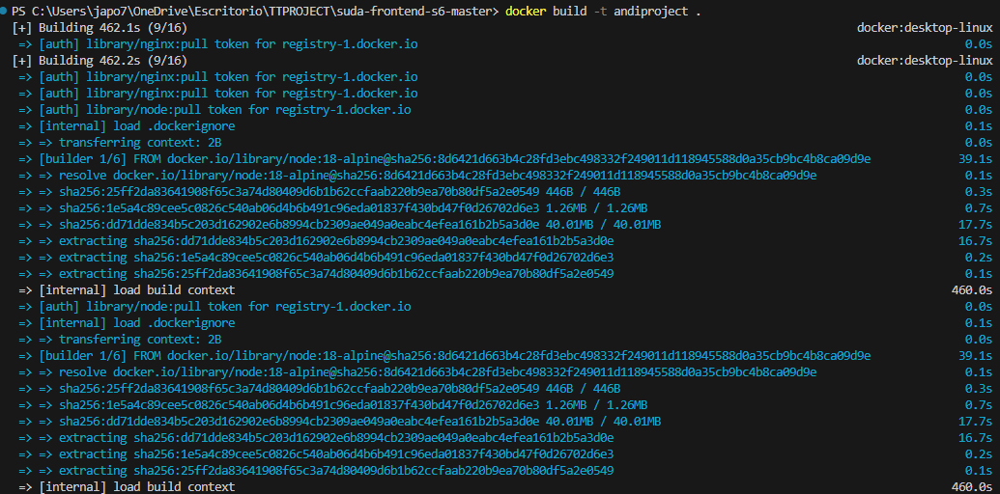
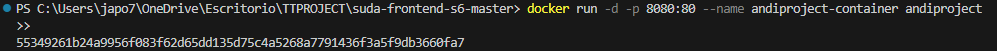

# Práctica Servidor Web

## 1. Título
Contenerización de Aplicación React con Docker y Nginx

## 2. Tiempo de duración
45 minutos

## 3. Fundamentos

Docker es una herramienta que permite empaquetar aplicaciones y sus dependencias en contenedores. Estos contenedores aseguran que la aplicación funcione de manera consistente sin importar dónde se ejecute.  
Nginx, por su parte, es un servidor web ligero y de alto rendimiento ideal para servir aplicaciones estáticas como las generadas por React.  
En esta práctica, se usan dos etapas en el Dockerfile: una para construir la aplicación con Node.js y otra para servirla con Nginx. Esta técnica mejora la eficiencia y reduce el tamaño de la imagen final.



*Figura 1-1. Diagrama general del proceso de contenerización.*

## 4. Conocimientos previos

Para realizar esta práctica necesite:
- Conocer comandos Linux (cd, ls, mkdir, etc.)
- Comprender estructura de proyectos React
- Manejo básico de navegadores web
- Conceptos básicos de contenedores
- Familiaridad con Docker

## 5. Objetivos a alcanzar

- Implementar contenedores usando Nginx para servir proyectos React.
- Manipular archivos de configuración (`nginx.conf`) para rutas SPA.
- Automatizar la construcción de imágenes con Dockerfile.

## 6. Equipo necesario

- Computadora con Windows/Linux/Mac
- Editor de código (VS Code)
- Docker Desktop instalado (v24.x o superior)
- Acceso a internet

## 7. Material de apoyo

- [Documentación oficial de Docker](https://docs.docker.com/)
- [Guía oficial de React](https://reactjs.org/)
- Cheat Sheet de comandos Docker
- Videos de la asignatura en el eva

## 8. Procedimiento

**Paso 1:** Crear el archivo `Dockerfile` en la raíz del proyecto.  
**Paso 2:** Crear el archivo `nginx.conf` en el mismo directorio.

**Figura 2-1. Dockerfile y nginx.conf**


**Figura 2-2. Codigo Dockerfile** 

**Codigo nginix.conf**


**Paso 3:** Ejecutar el siguiente comando para construir la imagen:  
```bash
docker build -t react-app .
````



**Paso 4:** Ejecutar el contenedor:

```bash
docker run -d -p 8080:80 --name react-container react-app
```



**Paso 5:** Abrir el navegador y visitar `http://localhost:8080`


## 9. Resultados esperados

Al abrir el navegador se debe visualizar la aplicación React servida desde el contenedor.

## 10. Bibliografía

Pressman, R. S. (2021). *Ingeniería del Software: Un Enfoque Práctico*. McGraw-Hill.

Docker Inc. (2024). *Docker Documentation*. Recuperado de [https://docs.docker.com](https://docs.docker.com)

React Team. (2024). *React Docs*. Recuperado de [https://react.dev](https://react.dev)

## Audio
https://drive.google.com/file/d/1Mr9OiZxPSOUJ8UI7hLqbFbIf3qkl7Etg/view?usp=sharing