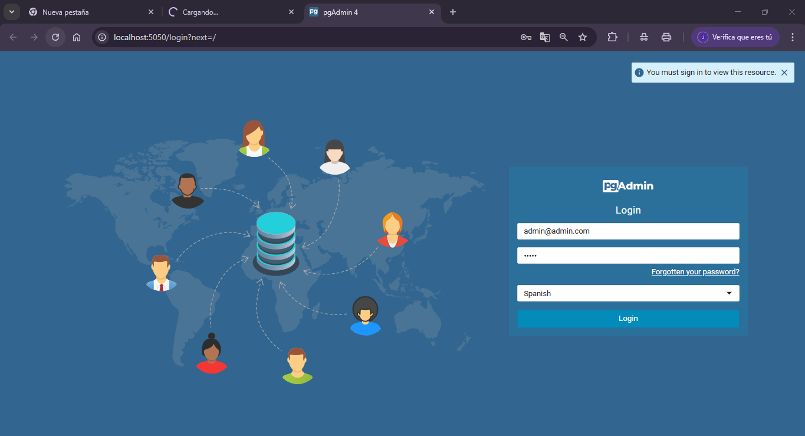

## 1. Título
Automatización del despliegue de una aplicación backend Kotlin con PostgreSQL y pgAdmin utilizando Docker y Docker Compose

## 2. Tiempo de duración
2 Horas

## 3. Fundamentos

En esta práctica se automatiza el despliegue de una aplicación backend desarrollada en Kotlin, que se conecta a una base de datos PostgreSQL, y se administra mediante la herramienta pgAdmin, todo utilizando contenedores Docker. El uso de Docker y Docker Compose permite encapsular cada servicio de forma independiente, facilitando la portabilidad y escalabilidad del sistema.

Docker es una plataforma que permite crear, probar e implementar aplicaciones en contenedores ligeros, portables y autocontenidos. Cada contenedor incluye todo lo necesario para ejecutar la aplicación: código, runtime, librerías y configuraciones del sistema. Docker Compose es una herramienta que permite definir y ejecutar aplicaciones multi-contenedor, a través de un archivo `docker-compose.yml`.

En esta práctica, también se implementa un enfoque de construcción multi-stage en el `Dockerfile`, lo que permite separar el proceso de compilación del de ejecución, optimizando así el tamaño de la imagen final y el tiempo de despliegue.


La arquitectura propuesta contiene tres servicios:
- **PostgreSQL** como sistema gestor de base de datos.
- **pgAdmin** como interfaz de administración.
- **Aplicación Backend** en Kotlin con Spring Boot, encargada de gestionar usuarios.

Estos servicios se comunican a través de una red personalizada definida en Docker Compose. Además, los volúmenes permiten la persistencia de datos aun cuando los contenedores se reinicien o eliminen.

## 4. Conocimientos previos

Para realizar esta práctica el estudiante debe tener conocimientos en:

- Comandos básicos de Linux.
- Manejo básico de terminal.
- Instalación y uso de Docker y Docker Compose.
- Fundamentos de redes en contenedores.
- Uso de archivos `.env`.
- Bases de datos relacionales (PostgreSQL).
- Fundamentos de Spring Boot y Kotlin.

## 5. Objetivos a alcanzar

- Automatizar el despliegue de un backend Kotlin con Docker.
- Configurar servicios de base de datos PostgreSQL y pgAdmin.
- Utilizar Docker Compose para definir múltiples servicios.
- Implementar `Dockerfile` con etapas multi-stage.
- Verificar la conectividad entre los servicios y persistencia de datos.

## 6. Equipo necesario

- Computador con sistema operativo Windows, Linux o Mac.
- Docker v24.x o superior.
- Docker Compose plugin.
- Acceso a Internet.
- Editor de código (Visual Studio Code recomendado).
- Navegador web.

## 7. Material de apoyo

- Documentación oficial de Docker: https://docs.docker.com
- Documentación oficial de PostgreSQL: https://www.postgresql.org/docs/
- Guía de la asignatura
- Cheat sheet de comandos de Linux
- Proyecto base: https://github.com/maguaman2/tendencias-mar22-security.git

## 8. Procedimiento

### Paso 1: Clonar el repositorio

```bash
git clone https://github.com/maguaman2/tendencias-mar22-security.git
cd tendencias-mar22-security
````

### Paso 2: Crear archivo `.env`

```env
POSTGRES_USER=admin
POSTGRES_PASSWORD=admin123
POSTGRES_DB=empresa_db
PGADMIN_DEFAULT_EMAIL=admin@empresa.com
PGADMIN_DEFAULT_PASSWORD=admin123
```

### Paso 3: Crear el archivo `docker-compose.yml`

```yaml
version: '3.8'

services:
  db:
    image: postgres:15
    container_name: postgres-db
    environment:
      POSTGRES_USER: ${POSTGRES_USER}
      POSTGRES_PASSWORD: ${POSTGRES_PASSWORD}
      POSTGRES_DB: ${POSTGRES_DB}
    ports:
      - "5432:5432"
    volumes:
      - postgres-data:/var/lib/postgresql/data
    networks:
      - backend-net

  pgadmin:
    image: dpage/pgadmin4
    container_name: pgadmin
    environment:
      PGADMIN_DEFAULT_EMAIL: ${PGADMIN_DEFAULT_EMAIL}
      PGADMIN_DEFAULT_PASSWORD: ${PGADMIN_DEFAULT_PASSWORD}
    ports:
      - "5050:80"
    networks:
      - backend-net

  backend:
    build:
      context: .
      dockerfile: Dockerfile
    container_name: backend-app
    depends_on:
      - db
    environment:
      SPRING_DATASOURCE_URL: jdbc:postgresql://db:5432/${POSTGRES_DB}
      SPRING_DATASOURCE_USERNAME: ${POSTGRES_USER}
      SPRING_DATASOURCE_PASSWORD: ${POSTGRES_PASSWORD}
    ports:
      - "8080:8080"
    networks:
      - backend-net

volumes:
  postgres-data:

networks:
  backend-net:
    driver: bridge
```

### Paso 4: Crear `Dockerfile` con multi-stage

```dockerfile
# Etapa de construcción
FROM gradle:7.6.0-jdk17 AS builder
COPY --chown=gradle:gradle . /app
WORKDIR /app
RUN gradle build --no-daemon

# Etapa de ejecución
FROM openjdk:17-jdk-alpine
COPY --from=builder /app/build/libs/*.jar app.jar
ENTRYPOINT ["java", "-jar", "/app.jar"]
```

### Paso 5: Construir e iniciar los contenedores

```bash
docker compose up --build -d
```

### Paso 6: Verificar servicios

* PostgreSQL estará disponible en `localhost:5432`.
* pgAdmin estará en `http://localhost:5050`.
* La aplicación backend estará en `http://localhost:8080`.




## 9. Resultados esperados

* Se espera tener los tres servicios levantados correctamente.
* pgAdmin puede conectarse a PostgreSQL con las credenciales definidas.
* La aplicación backend puede conectarse a la base de datos y exponer sus endpoints correctamente.


## 10. Bibliografía

Docker Inc. (2024). *Docker Documentation*. [https://docs.docker.com/](https://docs.docker.com/)

PostgreSQL Global Development Group. (2024). *PostgreSQL Documentation*. [https://www.postgresql.org/docs/](https://www.postgresql.org/docs/)

Pressman, R. S. (2010). *Ingeniería del software: un enfoque práctico* (7ma ed.). McGraw-Hill.

---

## Audio
https://drive.google.com/file/d/1kAKE3rN0UtzXqP3NBvARiGrFbfYixTTj/view?usp=sharing