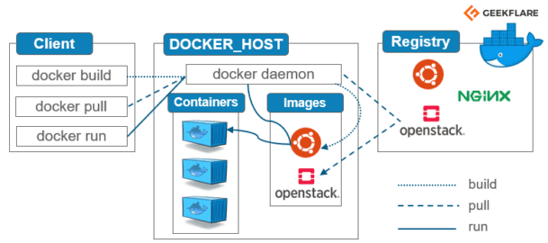
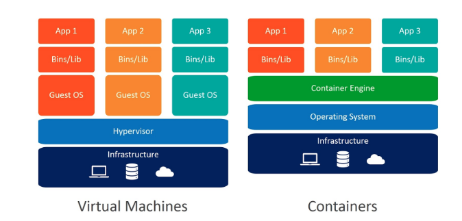
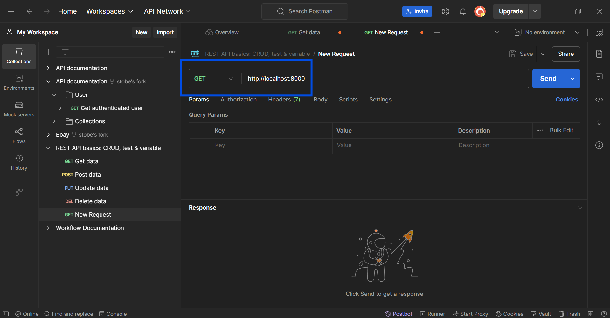

# Práctica Servidor Web

## 1. Título  
Contenerización de aplicación React para visualizar datos desde una API REST en Docker

## 2. Tiempo de duración  
180 minutos

## 3. Fundamentos  
En esta práctica se trabajó con la contenerización de dos aplicaciones: un **frontend con React** y un **backend REST**, utilizando **Docker** para que ambos se ejecuten en contenedores separados pero conectados en una misma red.  
La finalidad fue mostrar datos desde una API en una tabla, consumiendo los datos desde el frontend por medio de **peticiones HTTP (fetch o axios)** a un endpoint RESTful.

El backend se desarrolló en Node.js con Express (aunque puede ser cualquier stack como Spring Boot), y expone un endpoint que retorna datos en formato JSON sobre una entidad específica del proyecto.  
El frontend fue generado usando Create React App y muestra los datos en una tabla con HTML + CSS o alguna librería como Material UI o Bootstrap.

Docker permite encapsular ambos entornos y asegurar que se comporten igual sin importar el sistema operativo del host. Se usaron **Dockerfiles** para definir cómo construir las imágenes y un `docker-compose.yml` para orquestar los servicios (frontend, backend y base de datos si es necesario), garantizando su comunicación a través de una red compartida.



## 4. Conocimientos previos  
Para realizar esta práctica el estudiante necesita tener claro los siguientes temas:

- Comandos básicos de Linux
- Navegación por terminal
- Uso básico de Docker y Docker Compose
- Conceptos de REST API
- Desarrollo básico con React
- Comunicación cliente-servidor

## 5. Objetivos a alcanzar  
- Contenerizar aplicaciones frontend y backend con Docker  
- Consumir una API REST desde React  
- Mostrar los datos en una tabla  
- Lograr la comunicación entre contenedores usando `docker-compose`  

## 6. Equipo necesario  
- Computador con Windows / Linux / Mac  
- Docker Desktop v24+    
- Visual Studio Code u otro editor  
- Navegador actualizado  

## 7. Material de apoyo  
- [Documentación oficial de Docker](https://docs.docker.com)  
- [Cheat Sheet de Docker](https://dockerlabs.collabnix.com/docker/cheatsheet/)  
- Guia del eva  
- Documentación de React: https://reactjs.org  
- Documentación de Axios o Fetch API  

## 8. Procedimiento  

### Paso 1: Crear el backend  
- Se generó un backend simple con Express que devuelve datos JSON.
- Se creó un Dockerfile para contenerizarlo.

```dockerfile
FROM node:18-alpine
WORKDIR /app
COPY . .
RUN npm install
EXPOSE 3001
CMD ["node", "index.js"]
````

### Paso 2: Crear el frontend

* Se creó una app con `npx create-react-app frontend`.
* Se implementó una tabla que consume datos con `fetch`.

```js
useEffect(() => {
  fetch("http://backend:3001/entidad")
    .then(res => res.json())
    .then(data => setDatos(data));
}, []);
```

* Se creó un Dockerfile para el frontend:

```dockerfile
FROM node:18-alpine as build
WORKDIR /app
COPY . .
RUN npm install && npm run build

FROM nginx:alpine
COPY --from=build /app/build /usr/share/nginx/html
EXPOSE 80
```

### Paso 3: Crear el `docker-compose.yml`

```yaml
version: '3.8'
services:
  backend:
    build: ./backend
    container_name: api-backend
    ports:
      - "3001:3001"
    networks:
      - app-network

  frontend:
    build: ./frontend
    container_name: react-frontend
    ports:
      - "3000:80"
    depends_on:
      - backend
    networks:
      - app-network

networks:
  app-network:
    driver: bridge
```

### Figura 1-1. Diagrama de contenedores



## 9. Resultados esperados

* El navegador carga el frontend en `http://localhost:3000`.
* Se visualiza una tabla con los datos obtenidos desde la API.
* La API responde correctamente desde el contenedor backend.
* Ambos contenedores se comunican sin errores.




## 10. Bibliografía

Docker Inc. (2023). *Docker Documentation*. [https://docs.docker.com](https://docs.docker.com)
Meta. (2023). *React Documentation*. [https://reactjs.org](https://reactjs.org)
Mozilla. (2023). *Fetch API*. [https://developer.mozilla.org/es/docs/Web/API/Fetch\_API](https://developer.mozilla.org/es/docs/Web/API/Fetch_API)

## Audio
https://drive.google.com/file/d/16BSy3OZOOlye4GXZf8Qy1BjR6GKnq1dg/view?usp=sharing


