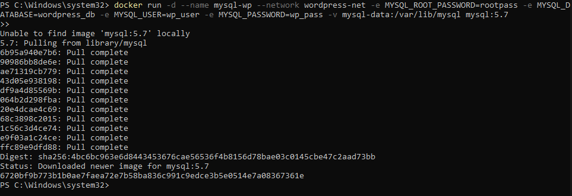

# Práctica servidor web

## 1. Título  
**Implementación de WordPress con contenedores Docker (MySQL, phpMyAdmin y WordPress)**

## 2. Tiempo de duración  
66 minutos

## 3. Fundamentos  

Docker es una plataforma de virtualización ligera basada en contenedores que permite empaquetar una aplicación con todas sus dependencias y ejecutarla de manera aislada. En esta práctica se utiliza Docker para desplegar un entorno WordPress compuesto por tres servicios: MySQL, phpMyAdmin y WordPress, interconectados a través de una red personalizada.

WordPress es uno de los CMS (sistemas de gestión de contenido) más populares del mundo, y su funcionamiento depende de una base de datos (MySQL) y de un servidor web. Para facilitar la administración de la base de datos, se incorpora phpMyAdmin, una herramienta web que permite gestionar MySQL gráficamente.

En lugar de instalar manualmente cada servicio, Docker permite desplegarlos como contenedores, lo que facilita el mantenimiento, portabilidad y escalabilidad. Cada contenedor se comunica con los demás a través de una red virtual y se mantiene persistencia de datos utilizando volúmenes.

Esta práctica promueve la comprensión de arquitecturas de microservicios y la orquestación de múltiples contenedores para construir una aplicación web completa. También se destacan temas como la separación de responsabilidades, persistencia de datos, mapeo de puertos, variables de entorno y la importancia de redes personalizadas.


## 4. Conocimientos previos  
Para realizar esta práctica, el estudiante necesita tener claro los siguientes temas:

- Comandos Linux básicos (navegación, creación de directorios, ejecución de scripts).
- Uso del navegador para acceder a servicios web.
- Fundamentos de redes (puertos, IPs locales).
- Uso básico de Docker (volúmenes, redes, contenedores).

## 5. Objetivos a alcanzar

- Implementar contenedores de WordPress, MySQL y phpMyAdmin.
- Manipular redes, volúmenes y variables de entorno en Docker.
- Acceder a servicios web locales usando puertos personalizados.
- Comprender cómo los servicios se comunican dentro de una red Docker.

## 6. Equipo necesario

- Computador con sistema operativo Windows/Linux/Mac.
- Cuenta en Docker Hub (opcional para descargar imágenes).
- Docker versión 20.10+ instalado.
- Terminal o consola de comandos.

## 7. Material de apoyo

- [Documentación oficial de Docker](https://docs.docker.com/)
- Guía de la asignatura
- Docker cheat sheet: https://dockerlabs.collabnix.com/docker/cheatsheet/

## 8. Procedimiento

**Paso 1:** Crear la red de Docker  
```bash
docker network create wordpress-net
```


**Paso 2:** Crear el volumen para MySQL  
```bash
docker volume create mysql-data
```


**Paso 3:** Crear el contenedor de MySQL 

(Aqui ocurrio que no reconocio el simbolo de \ por que estoy en powershell, en las capturas mostrare que lo hice con lineas para que funcione pero este comando que esta en el bash se usa normalmente en cmd :D  )

```bash
docker run -d \
  --name mysql-wp \
  --network wordpress-net \
  -e MYSQL_ROOT_PASSWORD=rootpass \
  -e MYSQL_DATABASE=wordpress_db \
  -e MYSQL_USER=wp_user \
  -e MYSQL_PASSWORD=wp_pass \
  -v mysql-data:/var/lib/mysql \
  mysql:5.7
```



O en powershell funciona:
para crear contenedor MySQL
```bash
docker run -d ^
--name mysql-wp ^
--network wordpress-net ^
-e MYSQL_ROOT_PASSWORD=rootpass ^
-e MYSQL_DATABASE=wordpress_db ^
-e MYSQL_USER=wp_user ^
-e MYSQL_PASSWORD=wp_pass ^
-v mysql-data:/var/lib/mysql ^
mysql:5.7
```

**Paso 4:** Crear el contenedor de phpMyAdmin  
```bash
docker run -d \
  --name phpmyadmin-wp \
  --network wordpress-net \
  -e PMA_HOST=mysql-wp \
  -p 8080:80 \
  phpmyadmin/phpmyadmin
```


**Paso 5:** Crear el contenedor de WordPress  
```bash
docker run -d \
  --name wordpress-site \
  --network wordpress-net \
  -e WORDPRESS_DB_HOST=mysql-wp:3306 \
  -e WORDPRESS_DB_NAME=wordpress_db \
  -e WORDPRESS_DB_USER=wp_user \
  -e WORDPRESS_DB_PASSWORD=wp_pass \
  -p 8000:80 \
  wordpress:latest
```


## 9. Resultados esperados

Al ejecutar todos los comandos correctamente, el estudiante podrá:

- Acceder a phpMyAdmin en `http://localhost:8080` y visualizar la base de datos `wordpress_db`.
- Acceder al instalador de WordPress en `http://localhost:8000` y completar el proceso de instalación del sitio.
- Ver cómo los servicios funcionan de manera aislada pero coordinada a través de Docker.

Captura del sitio WordPress en funcionamiento :


Captura del phpmyadmin en funcionamiento :


## 10. Bibliografía

Docker, Inc. (2024). *Docker Documentation*. https://docs.docker.com/

WordPress.org. (2024). *WordPress Documentation*. https://wordpress.org/support/

Pressman, R. S. (2014). *Ingeniería del software: Un enfoque práctico* (7ª ed.). McGraw-Hill.


## Audio:
https://drive.google.com/file/d/1KCceTRcgL--q5OnjllN8FtR8FBmxUXwp/view?usp=sharing