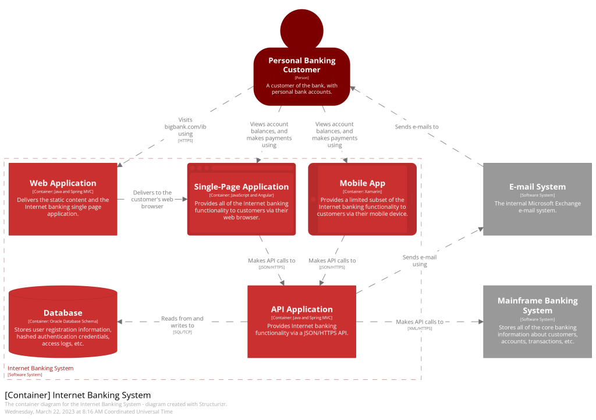
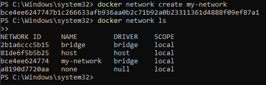
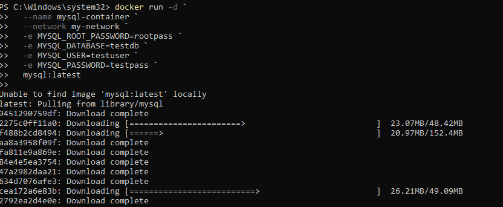
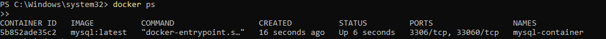
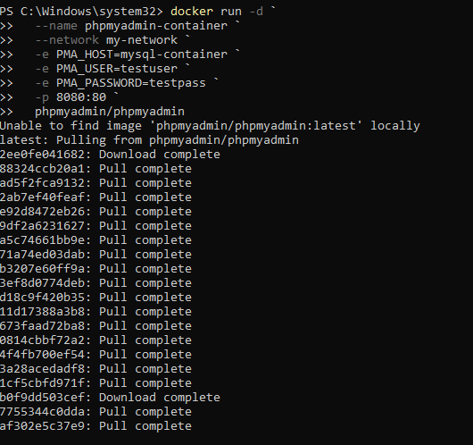
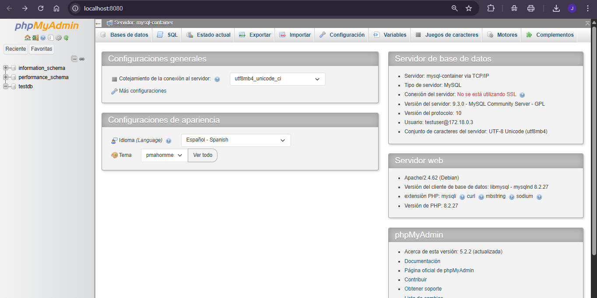

# Práctica Servidor Web - Semana 4

## 1. Título  
**Implementación de Contenedores Docker: MySQL y phpMyAdmin en Red Personalizada**

## 2. Tiempo de duración  
**45 minutos**

## 3. Fundamentos

Para comprender esta práctica es importante entender los conceptos de virtualización a través de contenedores, y cómo Docker permite aislar aplicaciones en entornos controlados y reproducibles. Docker utiliza imágenes predefinidas para crear contenedores, que son entornos ligeros y portables donde se ejecutan servicios como bases de datos o servidores web.

En este caso, se usan dos imágenes: `mysql` y `phpmyadmin/phpmyadmin`. La primera permite levantar un contenedor que actúe como un servidor MySQL. La segunda crea una interfaz web que facilita la gestión de bases de datos MySQL a través del navegador. Ambas deben comunicarse dentro de una misma red, por lo que se crea una red personalizada con Docker.

Estas herramientas se conectan a través de variables de entorno como `PMA_HOST`, que indica la dirección del contenedor de base de datos al que se desea conectar phpMyAdmin. Para visualizar resultados, se utiliza un navegador web que permite ingresar a la interfaz gráfica de phpMyAdmin.

**Figura 3-1. Diagrama de la arquitectura de contenedores en red:**




## 4. Conocimientos previos

Para realizar esta práctica, el estudiante necesita tener claros los siguientes temas:

- Comandos Linux básicos (`docker`, `cd`, `ls`, etc.)
- Manejo de puertos y redes en Docker
- Manejo de navegador web
- Fundamentos de MySQL
- Uso de variables de entorno


## 5. Objetivos a alcanzar

- Implementar contenedores con MySQL y phpMyAdmin.
- Crear y gestionar redes personalizadas en Docker.
- Configurar phpMyAdmin para conectarse con un servidor MySQL.
- Crear una base de datos desde una interfaz gráfica.
- Visualizar y verificar el correcto funcionamiento de ambos contenedores.


## 6. Equipo necesario

- Computador con sistema operativo Windows/Linux/Mac
- Terminal o consola
- Navegador web actualizado
- Docker v24.x o superior
- Cuenta en DockerHub (opcional)


## 7. Material de apoyo

- [Documentación oficial de Docker](https://docs.docker.com/)
- [Guía de la asignatura]
- [Cheat Sheet de comandos Linux](https://cheatography.com/davechild/cheat-sheets/linux-command-line/)


## 8. Procedimiento

### Paso 1: Crear una red personalizada

```bash
docker network create my-network
```




### Paso 2: Crear contenedor MySQL

```bash
docker run -d \
  --name mysql-container \
  --network my-network \
  -e MYSQL_ROOT_PASSWORD=rootpass \
  -e MYSQL_DATABASE=testdb \
  -e MYSQL_USER=testuser \
  -e MYSQL_PASSWORD=testpass \
  mysql:latest
```





### Paso 3: Crear contenedor phpMyAdmin

```bash
docker run -d \
  --name phpmyadmin-container \
  --network my-network \
  -e PMA_HOST=mysql-container \
  -e PMA_USER=testuser \
  -e PMA_PASSWORD=testpass \
  -p 8080:80 \
  phpmyadmin/phpmyadmin
```




### Paso 4: Acceder a phpMyAdmin

- Abrir navegador y entrar a:  
  `http://localhost:8080`
- Ingresar las credenciales:  
  **Usuario**: `testuser`  
  **Contraseña**: `testpass`




### Paso 5: Crear base de datos desde la interfaz

- Clic en "Nueva"
- Escribir nombre: `semana3_prueba`
- Clic en "Crear"


## 9. Resultados esperados

Se logró levantar ambos contenedores correctamente y comunicarlos mediante una red personalizada. Se pudo acceder desde el navegador a phpMyAdmin y conectarse al contenedor MySQL. Finalmente, se creó una base de datos de prueba usando la interfaz visual.


## 10. Bibliografía

Docker Inc. (2023). *Docker Documentation*. https://docs.docker.com/

Villalobos, M. (2022). *Guía de laboratorios de Servidores Web*. Universidad Técnica.

Child, D. (2023). *Linux Command Line Cheat Sheet*. Cheatography. https://cheatography.com/davechild/cheat-sheets/linux-command-line/


## Audio 
https://drive.google.com/file/d/1d1PHsJdrpW8rxlNNl3SpiaoVAUTpLDpK/view?usp=sharing