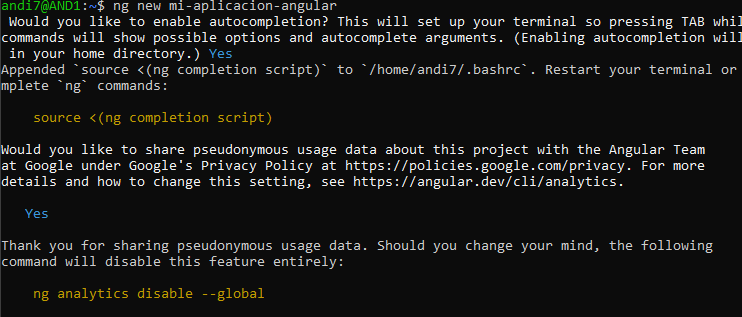

## 1. Título  
**Creación y Estructura de un Proyecto Angular utilizando WSL en Windows 10**

## 2. Tiempo de duración  

- Instalación de WSL: 15 minutos  
- Configuración inicial de Ubuntu: 15 minutos  
- Instalación de dependencias (Node.js, Angular CLI): 20 minutos  
- Creación del proyecto Angular: 10 minutos  
- Ejecución del servidor y verificación: 10 minutos  
- Generación de componentes y compilación: 20 minutos  

**Duración total aproximada:** 90 minutos

## 3. Fundamentos  

Angular es un framework frontend de desarrollo web creado por Google, basado en TypeScript. Su objetivo principal es facilitar la construcción de aplicaciones web modernas, escalables y mantenibles. Angular promueve el uso de componentes, módulos y servicios, permitiendo la reutilización del código y el trabajo en equipo organizado.

Angular CLI es la herramienta de línea de comandos oficial para Angular, la cual permite crear proyectos, generar componentes y servicios, correr servidores de desarrollo, y compilar aplicaciones listas para producción con facilidad.

Windows Subsystem for Linux (WSL) es una característica de Windows 10 que permite correr un sistema GNU/Linux directamente en Windows sin necesidad de máquinas virtuales. Con WSL, los usuarios pueden acceder a un entorno Linux completo desde la terminal de Windows. Esto facilita el uso de herramientas modernas de desarrollo web, como Node.js y Angular, que tradicionalmente han sido más estables en sistemas Unix.

Gracias a WSL, se puede trabajar como si estuviésemos en Linux, pero desde Windows, lo que mejora la compatibilidad de herramientas de desarrollo. Al instalar Angular CLI dentro de WSL, podemos ejecutar comandos Linux sin conflictos y levantar servidores de desarrollo accesibles desde el navegador en Windows.

**Figura 3-1. Estructura Angular con WSL (ejemplo)**  


## 4. Conocimientos previos  

Para realizar esta práctica, el estudiante debe conocer:

- Comandos básicos de Linux (cd, mkdir, ls, etc.)  
- Uso de terminal y navegación entre carpetas  
- Instalación de paquetes con `apt` y `npm`  
- Conceptos básicos de Angular (componentes, servicios, CLI)  
- Uso de navegador web para visualizar aplicaciones locales

## 5. Objetivos a alcanzar  

- Instalar y configurar WSL en Windows 10 para desarrollo web  
- Instalar Node.js, npm y Angular CLI en una distribución Ubuntu  
- Crear y ejecutar una aplicación Angular desde la terminal de Ubuntu  
- Visualizar y validar la ejecución del proyecto Angular desde el navegador de Windows  
- Crear componentes y compilar la aplicación para producción

## 6. Equipo necesario  

- Computador con **Windows 10 (versión 2004 o superior)**  
- Acceso a Internet para descargar paquetes  
- Distribución Linux (Ubuntu 20.04 o superior instalada vía WSL)  
- Terminal de Windows o Windows Terminal  
- Navegador web moderno (Chrome, Edge, Firefox, etc.)  
- Visual Studio Code (opcional)  
- Node.js versión 18.x o superior  
- npm versión 9.x o superior  
- Angular CLI versión 16 o superior

## 7. Material de apoyo  

- Documentación oficial de Angular: https://angular.io/docs  
- Guía de instalación de WSL: https://learn.microsoft.com/es-es/windows/wsl/install  
- Guía de la asignatura  
- Cheat sheet de comandos Linux: https://files.fosswire.com/2007/08/fwunixref.pdf

## 8. Procedimiento  

### Paso 1: Instalar WSL y Ubuntu  

Abrir PowerShell como administrador y ejecutar:  
`wsl --install`  

### Paso 2: Actualizar Ubuntu en WSL  


sudo apt update && sudo apt upgrade  


### Paso 3: Instalar Node.js y npm  

```bash
curl -fsSL https://deb.nodesource.com/setup_18.x | sudo -E bash -
sudo apt install -y nodejs
```
 
 
### Paso 4: Verificar versiones  

```bash
node -v
npm -v
```
 
### Paso 5: Instalar Angular CLI  

```bash
sudo npm install -g @angular/cli
```
 
### Paso 6: Crear un nuevo proyecto Angular  

```bash
ng new mi-aplicacion-angular
```
 
### Paso 7: Acceder a la carpeta y servir el proyecto  

```bash
cd mi-aplicacion-angular  
ng serve --host 0.0.0.0
```
 
### Paso 8: Visualizar desde el navegador  

Abrir `http://localhost:4200` desde el navegador en Windows
 
### Paso 9: Crear un componente y un servicio  

```bash
ng generate component saludo  
ng generate service datos
```

### Paso 10: Compilar para producción  

```bash
ng build --prod
```

## 9. Resultados esperados  

- Angular instalado y funcionando dentro de WSL  
- Proyecto creado y visible desde el navegador  
- Componente generado correctamente desde la CLI  
- Proyecto compilado en carpeta `dist/`  
- Entendimiento práctico del uso de WSL para desarrollo web

## 10. Bibliografía  

Angular.io. (2024). *Angular - Documentation*. https://angular.io/docs  
Microsoft Learn. (2024). *Instalar WSL*. https://learn.microsoft.com/es-es/windows/wsl/install  
NodeSource. (2024). *Node.js Linux Binaries*. https://github.com/nodesource/distributions  
Pressman, R. S., & Maxim, B. R. (2021). *Ingeniería del software: un enfoque práctico* (8a ed.). McGraw-Hill  

## Audio Explicativo
https://drive.google.com/file/d/1bKSiLsfrjjKFeripKzUOYhj9Bvas3qF9/view?usp=sharing